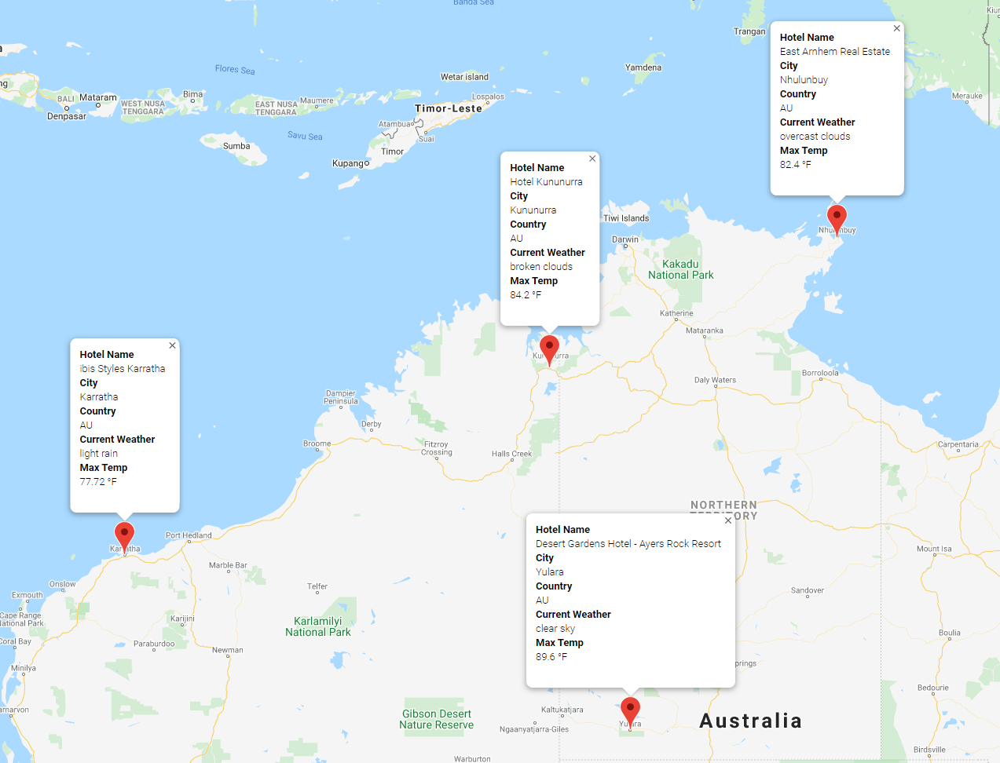

# Using OpenWeatherMap and Google Maps API to identify potential travel destinations
## Project Overview
These group of scripts takes advantage of OpenWeatherMap and Google Maps APIs, and is able to identify potential travel destinations and nearby hotels, based on the temperature range the user provides.

For this example, four locations were chosen to display cities that would fit the user's criteria and create a travel route and output a marker layer map of hotels to stay in those cities

## Summary 

Vacation Search

A temperature range between 75-90 degrees fahrenheit produced the following cities:
</img>

Out of these locations, Australia was chosen. Four cities chosen are below:
</img>

The route to follow:

</img>
